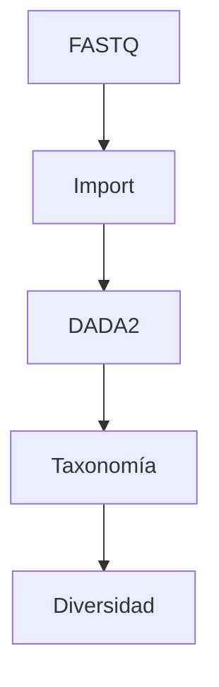

# UDCA_16S

Pipeline de análisis 16S usando QIIME2.

## Workflow

```mermaid
graph TD
A[FASTQ] --> B[Import]
B --> C[DADA2]
C --> D[Taxonomía]
D --> E[Diversidad]
```

## Repositorio

Este sitio se genera con GitHub Pages.
